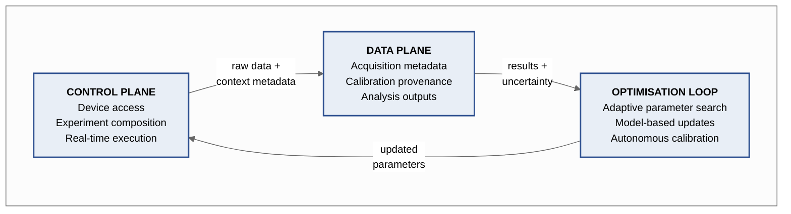
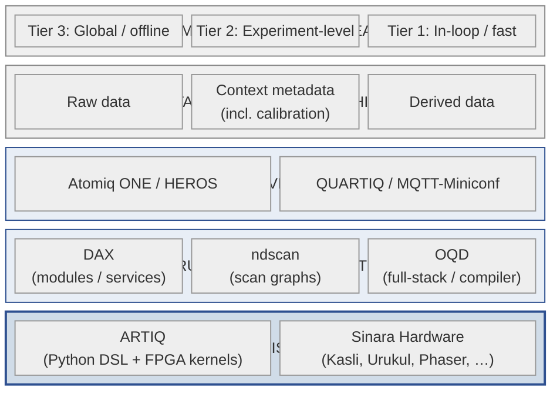
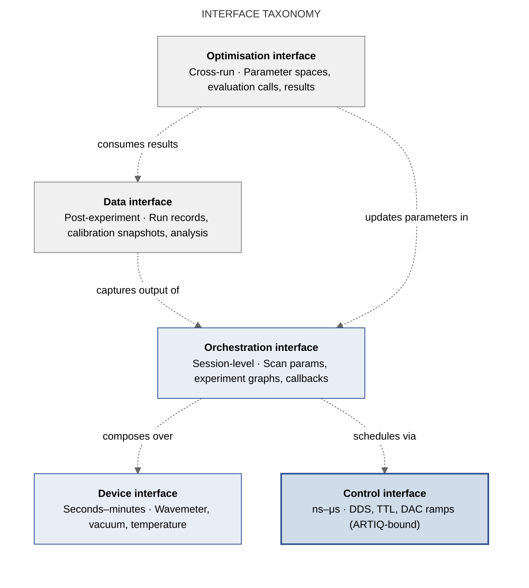

# Kompass-Dossier: Towards a Shared Infrastructure for Open-Source Quantum Laboratory Control

**Control, Data, and Interoperability in the ARTIQ Ecosystem**

*Draft for Community Discussion — Version 1.0-rc, March 2026*
*Physikalisches Institut, Albert-Ludwigs-Universität Freiburg*

---

> **Endorsement Marker.** This document is a Kompass-Dossier under the T(h)reehouse +EC platform. It maps a landscape; it does not endorse, rank, or recommend any project over another. Corrections, additions, and alternative perspectives are explicitly invited. Scope of endorsement: the author alone. This dossier carries no institutional endorsement from the Physikalisches Institut or any of the projects described.

> **Stewardship.** This dossier is stewarded by Ulrich Warring as a living community map. Stewardship means maintaining structure, incorporating factual corrections, versioning revisions, and preserving the document's non-prescriptive scope. Stewardship does not imply institutional authority, technical gatekeeping over the projects described, or unilateral authority to define interoperability standards for the ecosystem.
>
> **Revision policy.** Factual corrections (errors, outdated status, missing projects) may be incorporated directly. Interpretive changes (reframing, new analysis, shifted emphasis) are versioned explicitly and noted in the changelog. Substantial additions are attributed in the acknowledgements or changelog. Unresolved disagreements between contributors are logged rather than flattened — the dossier prefers documented diversity of views over forced consensus.

---

## 1. Motivation

Experimental quantum physics laboratories worldwide face a common challenge: translating the promise of open-source real-time control into a coherent, maintainable software stack that scales from a single PhD student's setup to a multi-experiment facility.

The **ARTIQ/Sinara** ecosystem, originally developed at NIST and maintained by M-Labs, has become the *de facto* open-source foundation for this task. Yet ARTIQ is deliberately generic: it provides low-level, nanosecond-precision access to FPGA-controlled hardware channels, but leaves higher-level abstractions — device orchestration, experiment templates, monitoring, safety interlocks, and integration with quantum computing frameworks — to each laboratory.

The result is predictable: several independent groups have built excellent abstraction layers on top of ARTIQ, each solving similar problems with different architectures, different APIs, and different community governance. Hardware drivers are written and rewritten; experiment sequences are not portable; new groups entering the field must choose a path without a clear map of the landscape.

This dossier does not propose a single solution. Instead, it maps the current ecosystem, identifies structural overlaps, and poses concrete questions about interoperability to the projects and their communities. The goal is to lower the barrier for synchronised collaboration — wherever it makes sense and wherever the communities involved see mutual benefit.

The challenge is not only to execute experiments reproducibly, but also to capture their metadata, calibration context, and analysis products in forms that support open scientific exchange, comparison with numerical models, and emerging journal and funder requirements for reusable data. The dossier therefore addresses interoperability along three complementary axes: the **control plane** (device access, experiment composition, real-time execution), the **data plane** (acquisition metadata, calibration provenance, analysis outputs, archival), and the **optimisation loop** (adaptive parameter search that closes the feedback cycle between execution and analysis).

*Figure 1. The three interoperability axes form a closed loop. Modern quantum laboratories do not operate the control plane in isolation; data acquisition feeds optimisation, which updates control parameters. Interoperability must address all three axes.*

**Scope exclusions.** This dossier does not attempt to evaluate scientific performance, benchmark framework quality, prescribe a preferred software stack, or define a universal experiment language. It does not cover cybersecurity in depth, nor does it address commercial or proprietary control systems. It focuses on interoperability opportunities at explicitly delimited interfaces within and around the open-source ARTIQ/Sinara ecosystem.

---

## 2. The Current Landscape

### 2.1 ARTIQ / Sinara (M-Labs; originally NIST)

ARTIQ (Advanced Real-Time Infrastructure for Quantum physics) is a Python-based control system with a domain-specific language for real-time kernel execution on Sinara FPGA hardware. It provides nanosecond-precision event scheduling, a timeline model, and device drivers for the Sinara hardware ecosystem (Kasli, Urukul, Zotino, Fastino, Phaser, etc.). ARTIQ is licensed under LGPL; Sinara hardware is licensed under CERN OHL v1.2.

Sinara was developed by a collaboration including M-Labs, QUARTIQ, Warsaw University of Technology (WUT), US Army Research Laboratory (ARL), the University of Oxford, the University of Maryland, the University of Oregon, NIST, and the University of Freiburg — the list of contributors and funders has grown beyond this core group.

**Strengths:** Proven at scale in dozens of laboratories worldwide; hardware ecosystem with commercial availability; active maintenance by M-Labs.
**Limitation:** Generic by design — no built-in abstractions for device grouping, experiment modularity, monitoring, or safety. Each lab builds its own layer.

### 2.2 QUARTIQ GmbH (Robert Jördens, Berlin)

[QUARTIQ](https://quartiq.de) is a key institutional actor in the ARTIQ/Sinara ecosystem. Co-founded by Robert Jördens (who is also affiliated with M-Labs), QUARTIQ develops firmware, algorithms, and components for distributed high-performance measurement and control in quantum technology. Their concrete contributions include:

- **Stabilizer** — Rust-based firmware for the Sinara Stabilizer module, providing high-speed, low-latency ADC/DAC processing with configurable DSP algorithms (dual-IIR, lockin). Communicates via MQTT/Miniconf, making it network-accessible and integrable into broader lab infrastructure.
- **Booster** — Firmware for the Sinara Booster 8-channel RF amplifier.
- **Thermostat-EEM** — Embedded firmware for multi-channel temperature control.
- **miniconf / idsp** — Rust libraries for configuration management and integer DSP, shared across Sinara firmware projects.

QUARTIQ occupies a distinctive position: they sit *between* the generic ARTIQ framework and the lab-specific abstraction layers, providing well-engineered, standalone firmware for critical Sinara modules. Their use of Rust (rather than Python) and MQTT-based telemetry/configuration represents an alternative architectural pattern to the Python-centric approaches of Atomiq ONE and DAX.

**Relevance to interoperability:** QUARTIQ's MQTT/Miniconf pattern is a natural fit for integration with Atomiq ONE's HEROS protocol (both use network-based device access). A shared device-discovery and telemetry schema between HEROS and Miniconf could be a high-impact, low-friction interoperability target.

### 2.3 Atomiq ONE (Stuttgart / Kaiserslautern)

[Atomiq ONE](https://atomiq.one) is an open-source quantum firmware that provides a hardware-orchestration layer on top of ARTIQ. Its core innovation is **HEROS** (Hardware-Enabled Remote Object Sharing), a decentralised protocol built on zenoh that transforms any Python object into a network-transparent "Remote HERO," accessible from anywhere in the lab network. The **MicroHERO** adapter extends this to non-Ethernet devices (UART, SPI, I2C, CAN, USB). Atomiq ONE also provides the **BOSS** (Object Starter Service) for instantiating HEROs, a monitoring and interlocking module, database/storage integration, and an abstraction layer that simplifies ARTIQ experiment writing (nix-free installation, component-based experiment definition).

**Strengths:** Elegant hardware orchestration; lightweight protocol; makes adding new non-ARTIQ devices trivial; active development.
**Current focus:** Neutral-atom platforms (adopters include Stuttgart, Kaiserslautern, Hamburg, RPTU, TII Abu Dhabi).
**Governance:** Led by three core developers (Hölzl, Niederprüm, Pomjaksilp); community via Matrix channel.

### 2.4 DAX — Duke ARTIQ Extensions (Duke University)

[DAX](https://gitlab.com/duke-artiq/dax) provides a modular software architecture for ARTIQ-based quantum control systems. Its design organises hardware channels into **Modules** (logical groupings of devices, e.g. a trap module, a cooling module) and **Services** (cross-module operations, e.g. ion loading, state detection). DAX introduces portable scanning infrastructure, standardised data storage, and a device-safety framework. Evaluation on the STAQ trapped-ion processor showed a 63% reduction in kernel execution-time overhead compared to monolithic ARTIQ code.

**Strengths:** Mature software-engineering approach to modularity and portability; demonstrated on real trapped-ion hardware; **QisDAX** provides a Qiskit-to-DAX bridge, enabling the first open-source end-to-end pipeline for remote submission to trapped-ion devices.
**Governance:** MIT-licensed; hosted on GitLab; maintained by the Brown group at Duke.

### 2.5 Open Quantum Design (OQD)

[OQD](https://docs.openquantumdesign.org/) is a non-profit foundation building a full-stack, open-source trapped-ion quantum computer. Its software stack defines three interface layers: **digital** (quantum circuits via openQASM / QIR), **analog** (Hamiltonian-level via openQSIM), and **atomic** (laser-matter interactions via openAPL). The real-time layer uses ARTIQ + DAX + OQDAX (their own DAX extensions). On the compiler side, PennyLane programs are compiled via Xanadu's Catalyst to MLIR, then lowered to ARTIQ/Sinara pulse instructions. Partners include Xanadu, University of Waterloo, and Unitary Foundation.

**Strengths:** Most ambitious scope (full vertical stack from Python to laser pulses); compiler integration with PennyLane/Catalyst; open hardware designs (blade trap).
**Current status:** Second-generation devices (Bloodstone based on ¹⁷¹Yb⁺, Beryl based on ¹³³Ba⁺) under construction. Software stack functional but early-stage.

### 2.6 Oxford Ion Trap Group (University of Oxford)

The [Oxford Ion Trap Group](https://oxfordiontrapgroup.github.io/) (Lucas, Ballance, Nadlinger et al.) has been a core contributor to both Sinara hardware design and ARTIQ software from the outset — the original Sinara collaboration paper lists Oxford alongside WUT, NIST, and M-Labs. Oxford maintains and publishes several open-source tools that complement the ARTIQ ecosystem:

- **ndscan** — An ARTIQ framework for composing experiments from reusable building blocks, with interactive one- or multi-dimensional scanning. This addresses the same experiment-composition problem as DAX and Atomiq ONE, but with a different design philosophy.
- **oxart / oitg** — Common Python libraries for trapped-ion physics (fitting, analysis, atomic structure calculations).
- **entanglement sequencer** — FPGA state machine for pulse sequencing and heralding logic in remote entanglement generation.
- **atomic_physics** — A toolkit for calculating state energies, transition matrix elements, rate equations, and solving OBEs.

Oxford's position is notable: several key members (Ballance, Harty, Löschnauer, Nadlinger) have moved to Oxford Ionics (now acquired by IonQ), but the academic group continues to develop and publish open-source tools. Their **ndscan** framework represents a third independent approach to experiment composition on ARTIQ, alongside DAX's module/service architecture and Atomiq ONE's component model.

**Relevance to interoperability:** Oxford's tools are widely used but not formally packaged as a unified framework. Documenting the relationship between ndscan, DAX, and Atomiq ONE's experiment abstraction would be valuable for new groups choosing a path.

### 2.7 NIST Contributions and the QED-C Control Electronics Initiative

NIST's Ion Storage Group (Leibfried, Slichter, Allcock, Wilson et al.) was the originating funder and early driver of ARTIQ and a major contributor to Sinara hardware design — particularly high-performance modules like Sayma (high-channel-count DAC) and Phaser. NIST continues to use and contribute to the ARTIQ/Sinara ecosystem for its trapped-ion quantum computing and quantum networking experiments.

In a broader context, the **Quantum Economic Development Consortium (QED-C)** and NIST recently completed (February 2026) a joint research programme to compact and optimise quantum control electronics. Working with industry partners including Rigetti, Amphenol RF, Maybell, and XMA, this programme produced a blueprint for smaller, more efficient quantum control hardware — a step towards moving quantum computers out of laboratory settings into standard data-centre racks. While not directly open-source software, this initiative shapes the hardware landscape on which ARTIQ/Sinara and its abstraction layers operate, and signals growing institutional interest in standardised control interfaces.

### 2.8 Adjacent Frameworks

Several other projects operate on related but distinct layers:

- **QCoDeS** (Microsoft / Copenhagen / Delft / Sydney) — Python data-acquisition framework with 50+ instrument drivers, used primarily in solid-state qubit labs.
- **labscript** — Experiment-composition framework for cold-atom physics.
- **QICK** and **QubiC** — RFSoC-based frameworks for superconducting qubit control (LBNL/AQT).
- **QubitControlStack (QCS)** — A newer proposal for a portable, embedded control framework with hardware abstraction.
- **Qibo** — Open-source framework for quantum simulation and self-hosted hardware control and calibration.

These projects are noted here for completeness but are not the primary focus of this dossier.

---

## 3. Structural Overlap Analysis

The following table maps core functionalities against the main ARTIQ-ecosystem projects.

| Functionality | ARTIQ | QUARTIQ | Atomiq ONE | DAX | OQD | Oxford |
|---|---|---|---|---|---|---|
| RT event scheduling (FPGA) | ✓ | — | ✓ (via ARTIQ) | ✓ (via ARTIQ) | ✓ (via ARTIQ) | ✓ (via ARTIQ) |
| Sinara device drivers | ✓ | ✓ (firmware) | ✓ | ✓ | ✓ | ✓ |
| Standalone module firmware | — | ✓ (Rust/MQTT) | — | — | — | (✓) entanglement seq. |
| Non-RT device orchestration | — | — | ✓ (HEROS) | (✓) | — | — |
| Non-Ethernet device adapters | — | — | ✓ (MicroHERO) | — | — | — |
| Modular experiment structure | — | — | ✓ (components) | ✓ (modules/services) | ✓ (via DAX) | ✓ (ndscan) |
| Portable scanning/sweeps | — | — | (✓) | ✓ | ✓ (via DAX) | ✓ (ndscan) |
| Monitoring & interlocks | — | ✓ (MQTT telemetry) | ✓ | (✓) safety module | — | — |
| Database / data storage | — | — | ✓ | ✓ | ✓ | — |
| Qiskit integration | — | — | — | ✓ (QisDAX) | ✓ (via QisDAX) | — |
| PennyLane/Catalyst compiler | — | — | — | — | ✓ | — |
| Nix-free installation | — | ✓ | ✓ | ✓ | ✓ | ✓ |
| Neutral-atom focus | — | — | ✓ | — | — | — |
| Trapped-ion focus | — | ✓ | — | ✓ | ✓ | ✓ |
| Atomic-physics toolkits | — | — | — | — | (✓) TrICal | ✓ (atomic_physics) |

**Key observation:** Three independent experiment-composition frameworks (Atomiq ONE components, DAX modules/services, Oxford ndscan) solve the same fundamental problem — ARTIQ is too generic for daily use — with architecturally different but functionally overlapping approaches. QUARTIQ's Rust/MQTT firmware layer is architecturally distinct and could serve as a natural bridge point, since its network-accessible telemetry pattern is compatible with both HEROS and DAX.

### 3.1 Three Control Philosophies

The overlap table reveals a deeper pattern. The ecosystem is stratifying into three orthogonal design philosophies, not competing implementations:

1. **Deterministic core** (ARTIQ / Sinara FPGA timeline). The causal layer: nanosecond-precision event scheduling, hardware-level timing determinism. All other layers depend on this; none replaces it.
2. **Structured orchestration** (DAX modules/services, ndscan). Software-engineering-first: strict typing, modular hierarchy, portable scanning, reproducible workflows. The organising question is *"how do I make this experiment maintainable and portable?"*
3. **Network-native abstraction** (Atomiq ONE / HEROS, QUARTIQ / MQTT-Miniconf). The organising question is *"how do I make every device accessible everywhere?"* Devices are network citizens; state is distributed; the lab is a single addressable system.

These philosophies are not competing — they are orthogonal projections of the same design space. A laboratory may need all three simultaneously: deterministic timing for gates, structured orchestration for experiment logic, and network-native access for monitoring and slow devices. Recognising this orthogonality is essential: interoperability does not require choosing one philosophy, but defining clean interfaces *between* them.

However, the philosophies encode different answers to foundational questions — *what is a device?* (a typed module, a network object, or an FPGA channel), *what is an experiment?* (a class hierarchy, a scan graph, or a sequence of component calls), *where does state live?* (in a registry, on the network, or in hardware). These are not merely implementation details; they are architectural identities. Any interoperability effort that ignores this will produce bridges that compile but do not compose.

**Central thesis of this dossier.** The practical goal of interoperability is therefore not to collapse these philosophies into a single framework, but to define narrow, explicit interfaces across which they can exchange devices, data, and optimisation workflows without erasing their architectural differences.

*Figure 2. Functional layering of the ARTIQ ecosystem. Layers are not maturity rankings; a laboratory may use components from any combination. The three control philosophies (deterministic core, structured orchestration, network-native abstraction) are shown as distinct layers; data and optimisation span across them.*

---

## 4. Interoperability Opportunities

### 4.1 Shared Driver Library

The most immediate opportunity is a common, well-documented library of device drivers that can be consumed by HEROS (Atomiq ONE), DAX modules, and ndscan (Oxford). This would eliminate duplicate effort for standard laboratory instruments (wavemeters, laser controllers, vacuum gauges, RF sources, temperature controllers).

**Scope constraint:** To be viable, such a library must be explicitly restricted to *non-real-time, side-effect-transparent device interfaces only*. It should standardise discovery, identification, and basic get/set semantics — but must explicitly *exclude* timing models, state-caching behaviour, and ownership of control loops. These are framework-specific concerns that, if forced into a shared interface, will silently fragment. The technical barrier is low if the scope is disciplined; it becomes intractable if the scope is not.

### 4.2 HEROS–Miniconf–MQTT Convergence

QUARTIQ's Miniconf/MQTT pattern and Atomiq ONE's HEROS/zenoh protocol both provide network-based access to devices and telemetry. A shared device-discovery and telemetry schema — or at minimum, a documented bridge between MQTT and zenoh — would allow QUARTIQ-firmware devices (Stabilizer, Booster, Thermostat) to appear natively in the HEROS network, and vice versa.

**Architectural caution:** This is not merely a schema problem. MQTT/Miniconf implements a *state-and-telemetry* model (publish/subscribe, key-value configuration); HEROS/zenoh implements an *object-and-method-invocation* model (remote procedure calls on Python objects). Bridging them requires choosing between state projection onto an object façade, or object flattening into state dictionaries. Both introduce information loss — in latency semantics, in ownership of control loops, and in error-propagation models. A viable bridge must document these losses explicitly and restrict its scope to monitoring and slow-control, not to real-time feedback paths.

### 4.3 HEROS–DAX Bridge

A bridge layer that allows a HERO-registered device to appear as a DAX module (or vice versa) would enable laboratories to mix and match: use Atomiq ONE's orchestration for non-real-time devices while running DAX's scanning and modular experiment infrastructure for the real-time core.

### 4.4 Experiment Composition Interoperability

Three frameworks (Atomiq ONE, DAX, ndscan) define their own way of composing experiments and scanning parameter spaces. A comparison document — or better, a set of "Rosetta Stone" examples showing the same experiment expressed in each framework — would help new groups make informed choices and could reveal opportunities for convergence.

**Worked example: wavemeter-stabilised laser frequency scan.** Consider a common task: scanning a laser frequency across a spectroscopic feature while a wavemeter provides feedback to stabilise the lock point at each step, recording fluorescence counts, and feeding the results into an adaptive algorithm that refines the scan range.

This single task touches all five interface classes:

| Interface class | What is involved |
|---|---|
| Device interface | Wavemeter readout (non-RT, network-accessible); laser controller setpoint |
| Control interface | PMT gating, AOM frequency updates (ARTIQ kernel, ns timing) |
| Orchestration interface | Scan definition, step logic, feedback branching |
| Data interface | Run record: laser setpoints, fluorescence counts, wavemeter readings, timestamps, software versions |
| Optimisation interface | Adaptive refinement of scan range based on measured lineshape |

In **raw ARTIQ**, this requires a monolithic experiment class with manual device management, inline scan logic, and ad-hoc data storage. In **DAX**, the wavemeter and laser become typed modules; scanning is handled by portable DAX scan infrastructure; safety checks are a service. In **ndscan**, the scan is a compositional graph with the laser frequency as a parameter axis and fluorescence as a result channel; the wavemeter provides a subscription-based annotation. In **Atomiq ONE**, the wavemeter is a HERO on the network; the laser controller is a component; the scan is orchestrated through the component API.

The physical task is identical. The code structure, state model, and data output differ in each case. Documenting these differences concretely — with minimal code sketches — would be the single most useful onboarding resource the community could produce.

### 4.5 Common Experiment Description Format

A shared intermediate format for AMO physics experiments — analogous to what openQASM is for quantum circuits, but at the physical-control level (load → cool → manipulate → detect) — would in principle make experiment templates portable across frameworks. OQD's openAPL (Atomic Programming Language) is a step in this direction but currently serves only their own stack.

**Risk assessment:** This is the highest-risk proposal in this dossier. AMO experiments are not composable in a circuit sense: sequencing depends on calibration state, hardware topology, feedback loops, and timing constraints that are fundamentally local. A generic format will either be too abstract to be useful, or too specific to be portable. OQD's openAPL works precisely because it is vertically integrated with a single hardware target. The "Rosetta Stone" approach (Section 4.4) is a more realistic path: documenting how each framework expresses the same physics, rather than imposing a common syntax.

### 4.6 Monitoring and Safety Interlock Standards

Atomiq ONE's monitoring module and QUARTIQ's MQTT telemetry are the most developed offerings in this space. Defining a standard schema for alarm conditions, interlock triggers, and logging formats would allow any ARTIQ-based lab to benefit, regardless of framework choice.

### 4.7 Atomic-Physics Calculation Toolkits

Oxford's `atomic_physics` library, OQD's TrICal, and various in-house tools across the community address the same need: calculating level structures, transition strengths, and rate equations. A shared, well-maintained toolkit — or at least documented interoperability between existing ones — would benefit everyone.

### 4.8 Teaching and Onboarding

A unified onboarding pathway — starting from ARTIQ basics and branching into Atomiq ONE, DAX, or ndscan depending on platform needs — would serve the growing number of new groups entering the field. Shared tutorial materials and a common "first experiment" example could be jointly maintained.

### 4.9 Data Management and Provenance Infrastructure

Interoperability in quantum laboratory control is not limited to device access and experiment execution. For open scientific research, a compatible data-management layer is equally important: experiment metadata, calibration state, hardware configuration, scan parameters, and analysis outputs must be stored in forms that support reproducibility, comparison with simulation, and long-term reuse in publications and shared repositories.

**Why this is load-bearing.** Three developments make data-plane interoperability a structural concern rather than an afterthought.

First, open scientific practice increasingly depends on reproducible, machine-readable datasets — not only readable code. A lab may share ARTIQ control code, but without structured metadata and provenance, others cannot reconstruct what was actually done.

Second, comparison with numerical data is central in AMO and quantum-control work. Experimental traces are constantly compared with simulation outputs, fitted model parameters, calibration histories, and uncertainty budgets. If these are stored in incompatible, ad-hoc formats, cross-lab comparison remains fragile even if control software is nominally interoperable.

Third, journals and funders are steadily pushing toward FAIRer data practices: data-availability statements, reusable supplementary material, and machine-readable metadata. The ecosystem's long-term viability requires alignment with these requirements.

**Three data layers.** A useful distinction is:

- **Raw data:** Detector counts, waveforms, images, time series — the irreducible experimental record.
- **Context metadata:** Device state, calibration values, software and firmware versions, pulse parameters, environmental conditions, scan configuration — everything needed to interpret the raw data and, in principle, to reproduce the experiment.
- **Derived data:** Fits, inferred parameters, simulated reference curves, uncertainty estimates, analysis scripts or commit hashes — the products of post-processing that connect raw data to published results.

Each framework currently handles these layers in its own way (HDF5 with framework-specific schemas, custom databases, flat files). A shared minimal schema need not replace these internal formats; it would provide a common *export* layer.

**Calibration as active metadata.** One category requires special treatment: calibration data (laser frequencies, beam alignments, trap voltages, servo parameters). Calibration straddles the boundary between data and control planes — it is "context" when interpreting historical measurements, but "active state" when it feeds back into adaptive experiments or automated retuning. A data interface schema that treats calibration as purely retrospective metadata will create a reproducibility gap: the record will show *what was measured* but not *what the system believed at the time of measurement*. The provenance schema should therefore distinguish between calibration-as-context (frozen snapshot for archival) and calibration-as-state (live values propagating bidirectionally between data storage and control flow).

**A common metadata and provenance schema.** A shared minimal schema for experiment runs could include: experiment identifier, timestamp, hardware configuration snapshot, software/firmware versions, scan parameters, calibration references, data-file pointers, and an analysis recipe or commit hash. This is deliberately less ambitious than a universal experiment-description language — and therefore more realistic.

**Strategic observation.** In practice, a minimal common metadata/provenance schema may be a more tractable first interoperability target than a shared experiment-description language. Groups can disagree on orchestration architecture while still agreeing on a minimal run record. A shared run record is much less invasive than harmonising control models, and it directly serves the needs of reproducibility, cross-lab comparison, and publication compliance.

**Repository and archival compatibility.** If shared components are developed, the communities should also consider whether generated datasets and metadata can be archived in formats compatible with institutional repositories, Zenodo-style deposits, and journal supplementary-data requirements. This is a governance concern as much as a technical one.

### 4.10 Adaptive Control and Parameter Search

Modern quantum laboratories increasingly rely on adaptive parameter search and optimisation algorithms that close a feedback loop between experiment execution, data acquisition, and model-based updates of control parameters. This loop operates on multiple timescales:

- **Tier 1 — Local / fast (in-loop).** Low-latency feedback within or near the real-time control system: PID loops, adaptive pulse shaping, small grid scans. Tightly coupled to the ARTIQ kernel and FPGA timeline. Not a candidate for cross-framework interoperability — this is architecture-specific by nature.
- **Tier 2 — Experiment-level / adaptive.** Operates over batches of experimental runs with moderate-dimensional parameter spaces: Bayesian optimisation, Nelder–Mead, CMA-ES, adaptive scanning. This tier sits naturally in the orchestration layer — DAX scanning, ndscan adaptive sweeps, Atomiq ONE component orchestration — and is where interoperability has the most to gain.
- **Tier 3 — Global / offline.** Large datasets, slow iteration, integration of simulation and experiment: surrogate models, machine-learning pipelines, global parameter inference. This tier belongs to the data infrastructure and HPC layer, consuming the metadata and provenance structures described in Section 4.9.

**Interoperability angle.** The goal is not a shared optimisation library — that would tightly couple to framework architecture (DAX scan objects, ndscan scan graphs, Atomiq ONE orchestration calls). What is realistic is a *minimal optimisation interface contract* defining:

- **parameter space definition** (names, types, bounds, constraints)
- **evaluation call** (submit parameters → execute experiment → return results)
- **result object** (measured values, metadata, cost/objective, uncertainty)

Such a contract would allow optimisation routines to operate across different control frameworks without prescribing their internal architecture. It would also enable third-party optimisation tools (e.g. M-LOOP, Ax, Optuna, or custom Bayesian pipelines) to interface with any ARTIQ-based lab through a common adapter.

**Strategic observation.** This addition reframes the ecosystem from a *control software landscape* to a *closed-loop experimental system* — which is where the field is heading (autonomous calibration, self-tuning experiments, digital twins). The three tiers also map cleanly onto the interface taxonomy in Section 6: Tier 1 ↔ control interface, Tier 2 ↔ orchestration interface, Tier 3 ↔ data interface.

---

## 5. Failure Modes

Any interoperability effort in this space must confront known failure modes. Stating them explicitly increases credibility and helps the community avoid predictable traps.

**Timing semantics mismatch.** The deterministic core (ARTIQ FPGA timeline) operates on nanosecond event scheduling with a hardware-enforced timeline cursor. Orchestration layers (HEROS, MQTT) operate on millisecond-to-second network latencies. Any bridge that leaks network-layer timing assumptions into the real-time path will produce silent, intermittent failures — the worst kind in a quantum experiment. Shared interfaces must enforce an explicit boundary: network-accessible components are *monitoring and slow-control only*; anything that touches the ARTIQ timeline stays within the ARTIQ kernel.

**State ownership conflicts.** DAX modules own their device state via a typed registry. HEROS exposes devices as network-transparent objects with distributed state. ndscan composes experiments as parameter-scan graphs with result callbacks. When a device is simultaneously accessible through two frameworks, the question "who owns the current state?" has no clean answer. Bridges must define ownership semantics — preferably by designating one framework as the authority for each device and reducing the other to a read-only view.

**Calibration coupling.** Experiment sequences in real laboratories depend on calibration data (laser frequencies, beam alignments, trap voltages) that is framework-specific and hardware-specific. A "portable experiment template" that does not carry its calibration context is not actually portable — it is a skeleton that must be re-fleshed in each lab. This limits the practical value of common experiment description formats (Section 4.5).

**Hidden real-time assumptions.** Many experiment sequences contain implicit timing constraints (e.g. "this cooling pulse must precede the gate by exactly 5 μs") that are not represented in any metadata. Porting such sequences between frameworks will silently break timing contracts unless the source framework has made these constraints explicit.

**Social lock-in.** Frameworks are not just code; they are communities with shared conventions, tacit knowledge, and institutional relationships. A graduate student trained in DAX thinks about experiments differently from one trained in ndscan. This cognitive lock-in is rational (deep expertise is valuable) but limits cross-framework adoption regardless of technical interoperability.

**Funding-driven fragmentation.** Each framework is sustained by specific funding streams and institutional affiliations. If interoperability work is not itself funded — or if it is funded through one project's grants — it risks being perceived as a takeover bid rather than a neutral effort. The governance structure must address this directly.

**Access control and auditability.** Once devices become network-visible (HEROS, MQTT) and labs adopt shared state for interlocks and monitoring, questions of authentication, authorisation, and audit trails become non-trivial. Who can write to a device? Who can modify interlock thresholds? Are parameter changes logged with operator identity? The current open-source frameworks largely assume trusted single-lab environments; multi-user or multi-site deployments will require explicit access-control models. This is not yet a crisis, but it will become one as network-native abstraction scales beyond individual research groups.

---

## 6. Interface Taxonomy

To give structure to the interoperability roadmap, we propose a minimal taxonomy of five interface classes. The first three correspond to the control-plane philosophies identified in Section 3.1; the fourth addresses the data plane; the fifth addresses the optimisation loop that connects them.

| Interface class | Scope | Timing domain | Example |
|---|---|---|---|
| **Device interface** | Non-RT, stateless where possible | Seconds to minutes | Wavemeter readout, vacuum gauge, temperature setpoint |
| **Control interface** | RT-constrained, ARTIQ-bound | Nanoseconds to microseconds | DDS frequency, TTL pulse, DAC ramp |
| **Orchestration interface** | Experiment composition layer | Session-level | Scan parameters, result callbacks, experiment graphs |
| **Data interface** | Metadata, provenance, archival | Post-experiment | Run records, calibration snapshots, analysis outputs |
| **Optimisation interface** | Parameter search contract | Cross-run | Parameter space definitions, evaluation calls, result objects |

The shared driver library (Section 4.1) should target the **device interface** class only. The **control interface** is ARTIQ's domain and should not be abstracted further. The **orchestration interface** is where the three frameworks genuinely diverge and where the "Rosetta Stone" approach (Section 4.4) is more realistic than unification. The **data interface** (Section 4.9) may be the most tractable first coordination target, because it does not require agreement on control architecture. The **optimisation interface** (Section 4.10) defines a minimal contract for adaptive search across frameworks — parameter spaces in, evaluation calls out, structured results back.

*Figure 3. The five interface classes and their relationships. Darker shading indicates tighter coupling to hardware. Interoperability targets are the lighter-shaded classes; the control interface (darkest) is ARTIQ's domain and should not be abstracted further. Dashed arrows show information flow between interfaces.*

---

## 7. Ongoing Institutional Initiatives

Beyond the project-level efforts described above, several institutional developments shape the context for interoperability:

- **QED-C / NIST control electronics programme** (completed February 2026): A blueprint for compact, standardised quantum control hardware. As hardware form factors converge, software interoperability becomes both more feasible and more valuable.
- **QVLS-iLabs** (Germany, Clusters4Future): Focused on transitioning trapped-ion quantum computers and sensors from university labs to industrial settings. Standardised control software is a prerequisite for this transition.
- **Oxford Ionics / IonQ acquisition** (2025): Key Oxford contributors to the open-source ecosystem have moved into industry. The long-term impact on open-source contributions from this group is unclear but worth monitoring.
- **Sinara hardware governance**: The Sinara project itself is a successful example of multi-institutional open-hardware collaboration with distributed governance. Its model — shared specifications, individual implementations, community review — could serve as a template for the software layer.
- **Funding agency mandates**: Horizon Europe, DFG, and DOE increasingly require open data management plans and standardised infrastructure as conditions of funding. This external pressure may shift interoperability from a community preference to an institutional requirement on a 3–5 year horizon.

---

## 8. Governance Considerations

Open-source interoperability succeeds or fails on governance, not technology. Any coordination effort must address:

1. **Where do shared components live?** A neutral repository (e.g. under a joint GitHub/GitLab organisation) prevents any single project from becoming the gatekeeper. The risk of *de facto* centralisation — where one project's maintainers absorb the shared layer into their own governance — must be actively managed.
2. **Who reviews and merges?** A rotating or shared maintainer model, with clear contribution guidelines and code-of-conduct, ensures sustainability. Single-maintainer dependencies are a known fragility in academic open-source.
3. **Licence compatibility.** ARTIQ uses LGPL; QUARTIQ firmware uses Apache 2.0; DAX uses MIT; OQD uses various open licences. Atomiq ONE's licence should be verified. Any shared layer must be compatible with all.
4. **Funding acknowledgement.** Contributors from funded projects need clarity on how contributions are credited in publications and reports. If interoperability work is funded through one project's grants, it risks being perceived as annexation rather than collaboration.
5. **Scope discipline.** The shared layer should remain thin. Attempting to unify entire frameworks would likely fail; interoperability at well-defined interfaces (see Section 6) is more realistic.
6. **Industry pull.** The Oxford Ionics/IonQ acquisition and the growing commercial trapped-ion sector create a pull towards proprietary stacks. The open ecosystem's long-term viability depends on sustained academic contribution and governance structures that survive individual personnel moves.
7. **Archival and repository compatibility.** If shared components produce datasets, the communities should ensure that metadata and data files are compatible with institutional repositories, Zenodo-style deposits, and journal supplementary-data requirements. This should be considered from the outset, not retrofitted.

---

## 9. Questions for the Community

This dossier is intended to open a conversation, not to prescribe outcomes. The following questions are addressed to the developers and users of all projects mentioned:

A. Is a shared driver library — scoped to non-RT, stateless device interfaces only — a realistic first step? What would the minimum interface standard look like?

B. Would a HEROS–Miniconf/MQTT bridge be technically feasible for monitoring and slow-control, without compromising the design principles of either protocol?

C. Is there appetite for a common experiment description format at the AMO-physics level, or is the diversity of experimental paradigms too great? (See the risk assessment in Section 4.5.)

D. How do the three experiment-composition approaches (Atomiq ONE components, DAX modules/services, Oxford ndscan) relate to each other architecturally? Is convergence desirable, or is diversity a feature?

E. What governance structure would the respective communities accept for shared components? Who would fund maintenance?

F. Is a common experiment-data schema (Section 4.9) a more tractable entry point for interoperability than the control layer?

G. What concrete test case would demonstrate that a shared driver library works reliably across the major abstraction layers?

H. Would a minimal optimisation interface contract (parameter space → evaluation → result) be useful across frameworks, or do the differences in scanning architecture make this impractical?

I. Are there other projects or groups that should be part of this conversation but are not mentioned here?

J. Would a workshop or hackathon (e.g. at a DPG meeting, DAMOP, or dedicated event) be a productive format for a first coordination meeting?

---

## 10. Proposed Next Steps

1. Circulate this dossier to the lead developers and key users of ARTIQ/M-Labs, QUARTIQ, Atomiq ONE, DAX, OQD, and the Oxford Ion Trap Group for comment and correction.
2. Collect responses and identify the subset of interoperability opportunities that have buy-in from at least two projects.
3. If sufficient interest exists, convene a virtual or in-person meeting to define a minimal shared interface specification (starting with the driver library or HEROS–MQTT bridge).
4. Document outcomes publicly and version the specification in a neutral repository.

**Most tractable first coordination targets** (observation, not directive):

1. A common run-record / provenance export schema (Section 4.9) — groups can disagree on architecture while agreeing on a minimal metadata package. Existing substrates (HDF5 for raw data, JSON/YAML for metadata manifests) provide a practical foundation.
2. A shared non-RT device interface specification (Section 4.1) — scoped to stateless get/set semantics for standard instruments.
3. A "Rosetta Stone" repository documenting the same physical task (e.g. the wavemeter-stabilised scan from Section 4.4) in raw ARTIQ, DAX, ndscan, and Atomiq ONE.
4. A monitoring / telemetry bridge experiment between HEROS and MQTT, with documented latency and information-loss characteristics.

**Minimal success criteria for a first coordination round:**

- One draft run-record schema accepted for review by at least two framework communities.
- One shared device-interface specification (e.g. for a wavemeter or temperature controller) demonstrated working in at least two frameworks.
- One cross-framework worked example published in a public repository.
- One agreed test case that would falsify the claim "the shared interface works reliably."

---

## 11. Closing Synthesis

This dossier's central claim is modest: the open-source quantum-control ecosystem does not need immediate unification, but it does need sharper interface discipline if it is to support reproducible, multi-lab, data-rich scientific practice. The most realistic first steps are narrow, explicit, and testable: shared non-RT device interfaces, common run-record exports, and documented bridges where architectural differences can be made explicit rather than denied.

The ecosystem is healthy precisely because it contains multiple independent solutions to the same problems. That diversity reflects genuine differences in experimental needs, community cultures, and design philosophies. The goal of interoperability is not to eliminate this diversity, but to make it navigable — so that a new group can choose a path with clear eyes, a laboratory can exchange data with a collaborator using a different framework, and the field as a whole can meet the rising expectations of open science without reinventing its infrastructure from scratch in every lab.

> *Project descriptions and status information in this document reflect publicly accessible sources as of March 2026. Corrections and updates are welcome.*

---

## Appendix A: Project Links and References

| Project | Primary URL |
|---|---|
| ARTIQ / Sinara | <https://m-labs.hk/artiq/artiq/> / <https://sinara-hw.github.io/> |
| QUARTIQ GmbH | <https://quartiq.de> / <https://github.com/quartiq> |
| Atomiq ONE | <https://atomiq.one/> |
| HEROS | <https://heros-761c0f.gitlab.io/> |
| DAX | <https://gitlab.com/duke-artiq/dax> |
| QisDAX | IEEE QCE 2023, doi:10.1109/QCE57702.2023.00097 |
| Open Quantum Design | <https://docs.openquantumdesign.org/> |
| PennyLane + Catalyst + OQD | pennylane.ai/blog (December 2025) |
| Oxford Ion Trap Group OS projects | <https://oxfordiontrapgroup.github.io/> |
| ndscan | <https://github.com/OxfordIonTrapGroup/ndscan> |
| atomic_physics | <https://github.com/OxfordIonTrapGroup/atomic_physics> |
| QCoDeS | <https://qcodes.github.io/> |
| Sinara Wiki | <https://github.com/sinara-hw/meta/wiki> |
| ARTIQ & Sinara (2020 paper) | Kasprowicz, Kulik, ..., Jördens et al., OSA Quantum 2.0, QTu8B.14 |
| Open Hardware in QT | arXiv:2309.17233v2 (Shammah et al.) |
| DAX (2022 paper) | Riesebos et al., arXiv:2210.14341 |

---

## Appendix B: Glossary

> This glossary defines key terms as used in this dossier. Where a term carries different meanings across frameworks, multiple interpretations are noted. Definitions are descriptive, not normative.

**ARTIQ kernel.** A function decorated with `@kernel` that executes on the FPGA core device with nanosecond timing. Kernels are compiled from a Python-like DSL to machine code. Distinct from host-side Python code, which runs on the controlling computer without real-time guarantees.

**Control plane.** The set of systems responsible for device access, experiment composition, and real-time execution. One of three interoperability axes in this dossier (see also: data plane, optimisation loop).

**Data plane.** The set of systems responsible for acquisition metadata, calibration provenance, analysis outputs, and archival. Includes raw data (detector counts, waveforms), context metadata (device state, software versions), and derived data (fits, uncertainty estimates).

**Device.** Context-dependent term. In ARTIQ: a driver object corresponding to an FPGA channel or set of channels. In DAX: a typed module encapsulating one or more ARTIQ devices with defined state and methods. In Atomiq ONE / HEROS: a network-transparent Python object ("HERO") exposable from any machine. In QUARTIQ firmware: an embedded system communicating via MQTT. These differences in the meaning of "device" are a root cause of interoperability friction.

**Experiment.** Context-dependent. In ARTIQ: a Python class with a `run()` method containing host and kernel code. In DAX: a structured composition of modules, services, and scanning infrastructure. In ndscan: a compositional scan graph with parameter axes and result channels. In Atomiq ONE: a component-based orchestration sequence. These different models of "what an experiment is" encode the architectural identities described in Section 3.1.

**HERO / HEROS.** Hardware-Enabled Remote Object Sharing. The core protocol of Atomiq ONE, built on zenoh. Transforms any Python object into a network-transparent remote object accessible from anywhere in the lab network.

**Host / host-side.** Code that runs on the controlling computer (not the FPGA). Manages experiment setup, data collection, and communication with non-real-time devices. Latency: milliseconds or longer.

**Interface class.** One of five categories defined in this dossier's taxonomy (Section 6): device interface, control interface, orchestration interface, data interface, optimisation interface. Each has a defined scope and timing domain.

**MicroHERO.** A microcontroller-based adapter in the Atomiq ONE ecosystem that connects non-Ethernet devices (UART, SPI, I2C, USB) to the HEROS network.

**Miniconf.** QUARTIQ's configuration management protocol for Sinara firmware, using MQTT for settings and telemetry. Implements a state-and-telemetry model (publish/subscribe, key-value) distinct from HEROS' object-and-method model.

**Module (DAX).** A logical grouping of ARTIQ devices representing a physical subsystem (e.g. a trap, a laser, a cooling system). Modules own their devices' state and expose typed interfaces.

**ndscan.** Oxford Ion Trap Group's ARTIQ framework for composing experiments as multi-dimensional scan graphs with interactive parameter exploration.

**Non-real-time (non-RT).** Operations without hard timing guarantees — typically network-accessible device queries, slow-control adjustments, monitoring. Latency: milliseconds to seconds. The shared driver library (Section 4.1) targets this domain exclusively.

**Optimisation loop.** The feedback cycle in which measured results inform parameter updates for subsequent experiments. Operates at three timescales: in-loop / fast (Tier 1), experiment-level / adaptive (Tier 2), global / offline (Tier 3).

**Provenance.** The chain of information linking a measurement result to the hardware configuration, software versions, calibration state, and analysis procedures that produced it. Essential for reproducibility and cross-lab comparison.

**Real-time (RT).** Operations with hard timing guarantees enforced by FPGA hardware. In ARTIQ: nanosecond-precision event scheduling via the timeline cursor. The control interface (Section 6) operates in this domain.

**Run record.** A minimal metadata package describing a single experiment execution: identifier, timestamp, hardware configuration, software versions, scan parameters, calibration references, data-file pointers, analysis commit hash. Proposed as a tractable first interoperability target (Section 4.9).

**Scan / sweep.** A systematic variation of one or more experiment parameters across defined ranges. Each framework implements this differently: DAX via structured scan objects, ndscan via compositional scan graphs, Atomiq ONE via component-level orchestration.

**Service (DAX).** A cross-module operation that coordinates multiple modules to perform a repeatable task (e.g. ion loading, state detection, calibration).

**Sinara.** Open-source hardware ecosystem (CERN OHL v1.2) providing modular control electronics for quantum experiments. Includes Kasli (controller), Urukul (DDS), Zotino/Fastino (DAC), Phaser (RF), Stabilizer (DSP), and others.

**Timeline / timeline cursor.** ARTIQ's model for scheduling real-time events. The cursor advances through time; events are placed at cursor positions with nanosecond precision. This is the causal core of the control plane.

---

## Appendix C: Onboarding Pathways (Informative, Non-Normative)

> This appendix provides orientation for new laboratories entering the ARTIQ ecosystem. It describes entry points and decision criteria, not recommendations. Each pathway leads to different architectural trade-offs; the "right" choice depends on local needs, existing infrastructure, and community connections.

### Path A — Minimal ARTIQ entry

**Start here if:** You are new to the ecosystem and want to understand the foundation before choosing an abstraction layer.

**What you will learn:** Installing ARTIQ, connecting to Sinara hardware (Kasli + satellites), writing your first host-side experiment, executing a real-time kernel (TTL pulses, DDS control), understanding the timeline model.

**Key resources:** ARTIQ documentation (m-labs.hk), Sinara Wiki (github.com/sinara-hw/meta/wiki).

**Where this leads:** After mastering basic ARTIQ, you will encounter the limitations that motivated DAX, ndscan, and Atomiq ONE — experiment code becomes monolithic, device management is manual, scanning requires custom code. At that point, consider Paths B or C.

### Path B — Structured experiment workflows

**Start here if:** You need modular, maintainable experiment code with portable scanning, especially for trapped-ion systems.

**Options:**
- **DAX** (Duke): Modules, services, structured scanning, device safety. Best documented for trapped-ion computing workflows. Includes QisDAX for Qiskit integration.
- **ndscan** (Oxford): Compositional scan graphs with interactive exploration. Physics-first design; widely used in Oxford-style ion-trap labs.

**Key decision:** DAX emphasises software-engineering rigour (typed modules, explicit state management). ndscan emphasises compositional flexibility (scan graphs, interactive parameter exploration). Both run on ARTIQ; they are not currently interoperable with each other.

### Path C — Networked lab infrastructure

**Start here if:** You have many non-ARTIQ devices (lasers, sensors, instruments with serial/USB interfaces) and want a unified view of your entire lab.

**Framework:** Atomiq ONE / HEROS. Provides network-transparent device access, MicroHERO adapters for non-Ethernet devices, monitoring and interlocking, nix-free ARTIQ installation, and a simplified experiment abstraction.

**Key decision:** Atomiq ONE's current adopter base is predominantly neutral-atom labs. If you work with trapped ions, you may need to contribute ion-specific components (see Section 4 of the main dossier).

### Path D — Data management and optimisation

**Start here if:** You already have a working control stack and want to improve reproducibility, cross-lab comparison, or adaptive experiment workflows.

**Components:** This pathway is framework-agnostic. Key concerns include: structured run records (Section 4.9), calibration provenance, integration with analysis pipelines, and adaptive parameter search (Section 4.10). No single framework currently provides a complete solution; this is an active area for community coordination.

### Path E — Full-stack quantum computing

**Start here if:** You want an end-to-end open-source pipeline from quantum circuit description to hardware pulses.

**Framework:** Open Quantum Design (OQD). Provides digital, analog, and atomic programming interfaces, PennyLane/Catalyst compiler integration, and builds on ARTIQ + DAX for real-time control. Currently early-stage; second-generation hardware under construction.

---

*Version history: v0.1 — initial landscape draft. v0.2 — added QUARTIQ, Oxford, NIST/QED-C. v0.3 — three control philosophies, failure modes, interface taxonomy. v0.4 — three-axis scope (control + data + optimisation). v0.5 — central thesis, calibration as active metadata. v0.6 — figures, glossary, onboarding pathways. v1.0-rc — scope exclusions, worked example, security note, closing synthesis with success criteria and prioritisation; editorial cleanup.*
